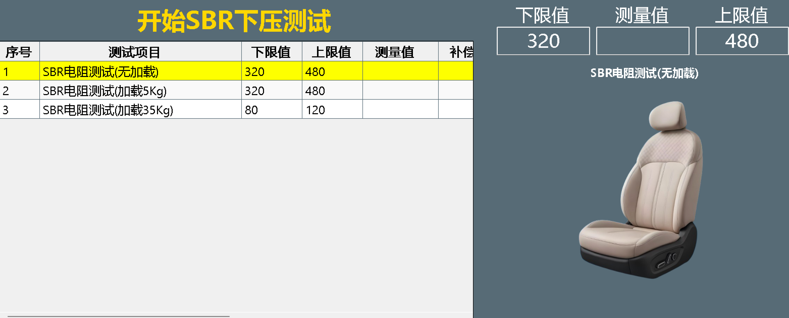
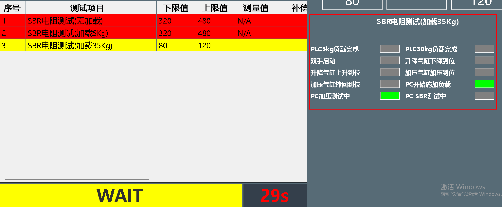
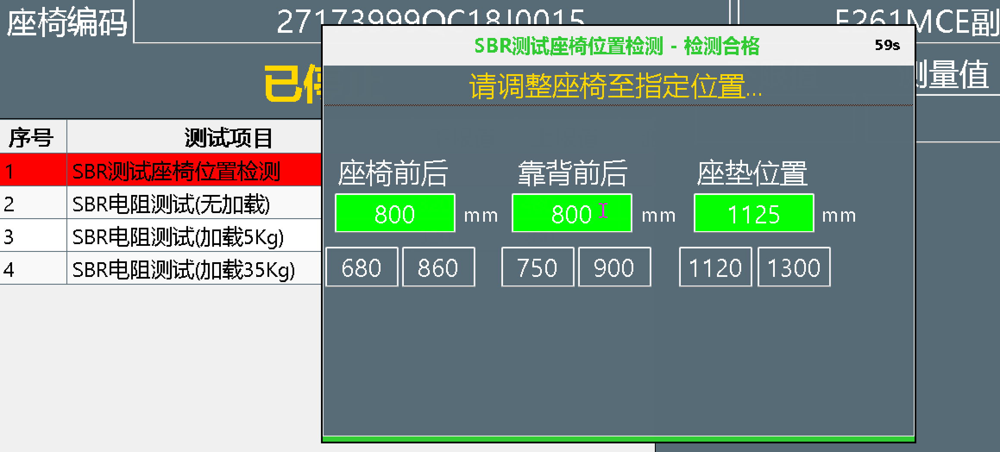

# ZL.Sop - WinForms SOP 步骤自动化管理框架

在工业现场、测试台架或复杂操作流程中，您是否还在为 WinForms 应用的 SOP（标准操作流程）步骤管理而头疼？

## 🎯 典型场景

*   **产线操作**：操作员根据屏幕指示完成装配、检测，合格自动进入下一步，不合格立即提示
*   **设备测试**：SOP界面在主窗口内实时切换指导，关键节点弹出强制性提示
*   **自动化控制**：根据PLC反馈自动触发SOP流程步骤完成或中止

## 😫 常见痛点

*   **UI管理混乱**：弹窗生命周期管理复杂，容易出现白屏或内存泄漏
*   **计时器地狱**：每个步骤都要单独处理倒计时、超时判断，代码冗余易错
*   **耦合严重**：业务逻辑与UI代码紧密耦合，难以维护和复用
*   **集成困难**：外部信号（PLC、传感器）集成复杂，需要处理线程安全
*   **定制麻烦**：特殊需求（如无计时步骤、不同延时）需要频繁打补丁

## 🚀 解决方案

WinForms SOP 步骤自动化管理框架，封装所有复杂性，让您像搭积木一样构建稳定、灵活、高效的SOP流程。

## ✨ 核心功能

### 1. 灵活的显示模式

*   **嵌入式**：`DisplayMode = "Embedded"`，步骤在主窗口内流畅切换
*   **弹窗式**：`DisplayMode = "ModalPopup"`，关键步骤强制弹出，确保不被遗漏

### 2. 自动生命周期管理

*   **合格自动消失**：`PassDelayMs` 配置毫秒级延时，提供合适反馈时间
*   **超时自动关闭**：`TimeoutMs` 控制执行时限，防止流程卡死
*   **纯展示模式**：配置 `AllowStepTimeout = false` 和 `RequireCountdown = false`，实现无计时展示

### 3. 强大的外部集成

```csharp
SopViewManager.TriggerCurrentStepCompletion(commandKey, isPassed, message);
```

支持PLC信号、按钮点击等外部事件安全触发步骤完成或中止

### 4. 清晰的架构分离

*   专注业务逻辑：只需实现 `ISopBusinessUnit` 接口
*   框架处理通用交互：UI渲染、状态条、倒计时、延时等均由框架管理

### 5. 高可靠性

*   内置白屏修复机制
*   基于工厂模式与单例缓存，高效管理控件实例

### 6. 案例
以下是相关的应用场景（单个的组件需要自己实现，内置图片展示组件）

*   复杂报文监控面板
[]
*   信号监控面板
[]
*   弹出提醒（带倒计时，合格后自动关闭，超时自动关闭）
[]
*   复杂报文监控面板
[]


## 📦 安装与使用

1.  通过NuGet安装包（ZL.Sop）
2.  实现 `ISopBusinessUnit` 接口定义业务逻辑
3.  配置SOP步骤参数
4.  启动SOP管理器

## 📁 代码仓库

*   **Gitee（国内镜像）**：<https://gitee.com/qwdingyu/ZL.Sop>
*   **GitHub**：<https://github.com/qwdingyu/ZL.Sop>

## 📄 许可证

MIT License

## 🤝 贡献

欢迎提交Issue和Pull Request！

## 📞 支持

如有问题或建议，请通过仓库Issue提交反馈。
